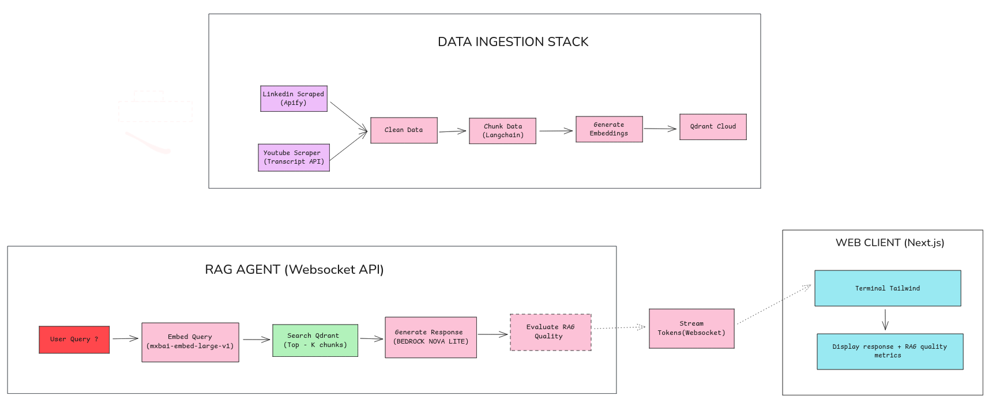
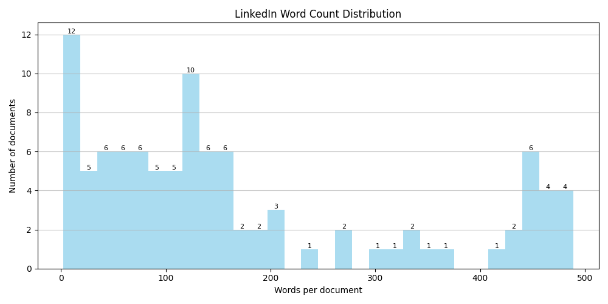
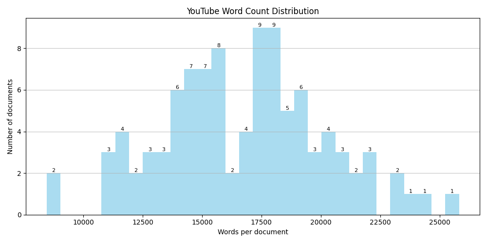
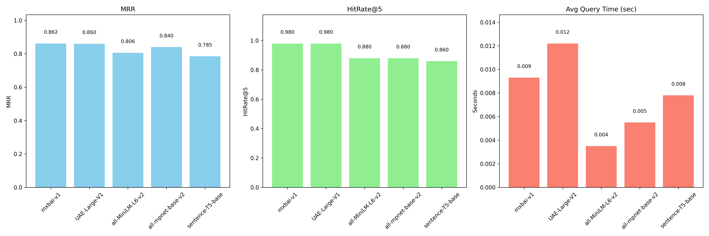
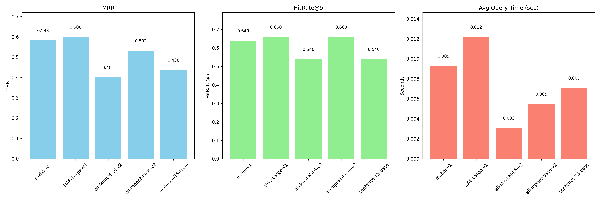

# Virtual Lenny - Architecture & Stack Breakdown

**A RAG-powered conversational agent inspired by Lenny Rachitsky’s writing and product thinking**

This document explains **how the system is structured**, what **each AWS stack does**, and the **role of every Lambda function** . 

---

## System Overview

At a high level, Virtual-Lenny follows a fairly standard modern RAG flow: content is ingested from multiple sources(linkedin & youtube in our case), processed into high-quality embeddings, stored in a vector database, and queried in real time by a streaming conversational agent.

In the current implementation, LinkedIn posts and YouTube transcripts are scraped, cleaned, chunked, embedded, and stored in **Qdrant**. At query time, a WebSocket-based backend retrieves relevant chunks, builds a grounded context, and streams responses token-by-token to a lightweight web client.

## Overall Structure

Complete architecture : 

The project is split into three major backend stacks and one frontend layer:

1. **Storage Stack** -- where data lives  
2. **Ingestion Stack** -- how raw content becomes searchable knowledge  
3. **WebSocket / RAG Stack** -- how user queries are answered in real time  
4. **Frontend (Vercel)** -- how users interact with the system  

> [!NOTE] 
> Each stack is deployed independently using AWS CDK . 

---

## 1️⃣ Storage Stack (`storage_stack.py`)

**Purpose**  
This stack is deliberately simple: it provides a single, reliable place where *all data flows through* during ingestion. Nothing fancy, just a solid backbone.

Instead of creating new infrastructure, it references an existing S3 bucket (`virtual-lenny-bucket`) to stay safely within the AWS free tier.

---

### Data Layout (How things are organized)

All data lives under one logical `data/` hierarchy:

- **raw/**
  - **youtube/** – raw transcripts pulled from YouTube
  - **linkedin/** – raw LinkedIn posts from Apify

- **processed/**
  - **youtube/** – cleaned YouTube text
  - **linkedin/** – cleaned LinkedIn text

- **chunks/**
  - **linkedin_chunks/** – one chunk per LinkedIn post
  - **youtube_chunks/** – recursively split transcript chunks

- **embedded/**
  - `corpus.pt` (older Torch-based experiments)
  - `corpus.npz` (final NumPy-based embeddings used in Lambda)

---

### Chunking Strategy (one of the most important decisions)

Chunking ended up being very **data-dependent**. There wasn’t a single strategy that worked well across everything, so I treated each source differently based on how the content is actually written and consumed.

There are two very different sources in this system, and they behave very differently during retrieval.

**1. LinkedIn**
- Each LinkedIn post is kept as **one full chunk**
- LinkedIn posts are already short, opinionated, and self-contained
- Splitting them further actually *hurts* retrieval quality because it breaks the narrative

This wasn’t just a hunch - a simple word-count and retrieval ablation showed that performance peaks when each post maps to exactly one chunk.

---

**2. YouTube**
- YouTube transcripts are long, noisy, and conversational
- A single transcript often covers multiple ideas over time
- These are split using **recursive chunking**

The target chunk size is ~2000 characters with overlap. Recursive splitting preserves sentence boundaries and avoids cutting ideas mid-way, which noticeably improved retrieval consistency.

---

### Embedding Model Choice

This was honestly the trickiest decision in the whole system.

I wanted an embedding model that doesn’t just look good on global benchmarks, but actually captures **local semantic structure** in *this* dataset (LinkedIn + YouTube, opinion-heavy and conversational).

While exploring this, I came across a very relevant paper: **Beyond Benchmarks: Evaluating Embedding Model Similarity for Retrieval Augmented Generation Systems**  : https://arxiv.org/abs/2407.08275

One thing that stood out from the paper is that **global leaderboard scores don’t always translate to better RAG performance on real datasets**.

At first glance:
- **text-embedding-3-large** → excellent quality, but paid
- **SFR-Embedding-Mistral** → very strong, but impractical (40GB+), especially for local testing and Lambda

So instead of guessing or blindly following benchmarks, I validated this properly.

I created a **synthetic evaluation dataset** using both LinkedIn posts and YouTube transcripts.  
Questions were generated locally (Ollama + localhost) using a custom script, and then used to evaluate retrieval quality across multiple embedding models.

Each model was evaluated on:
- Mean Reciprocal Rank (MRR)
- HitRate@5
- Average query latency

I ran a small ablation across models referenced in the paper, plus a few widely used open-source baselines.

On linkedin data : 

Youtube data : 

Mixed data : 

> [!IMPORTANT]
> The goal here was not to pick the “best embedding model in general”, but the one that works **best for this specific data**.

I evaluated performance separately on:
- LinkedIn-only data
- YouTube-only data
- Combined dataset

(Plots omitted here for brevity, but all three showed the same trend.)

Across all three setups, **`mixedbread-ai/mxbai-embed-large-v1`** consistently came out on top.

It:
- Outperformed lighter models like MiniLM and MPNet
- Matched or exceeded larger models on retrieval quality
- Stayed small enough to run inside Docker-based Lambda without pain

That’s why **`mixedbread-ai/mxbai-embed-large-v1`** was chosen for the final system.

It does introduce a small cold-start cost due to model loading, but the improvement in retrieval quality made that trade-off well worth it.

## 2️⃣ Ingestion Stack (`ingestion_stack.py`)

Turns raw internet content into high-quality vector embeddings stored in Qdrant.

This stack is orchestrated using **AWS Step Functions**, which lets each stage run independently with clear success/failure boundaries.

#### 1. `scrape_linkedin`
- Uses **Apify** to fetch LinkedIn posts
- Stores raw post data in S3

Scraping is slow and external-API dependent. Keeping it isolated makes retries safer.

#### 2. `scrape_youtube`
- Fetches YouTube transcripts using the YouTube Transcript API
- Writes raw transcripts to S3
 
YouTube has different failure modes and rate limits than LinkedIn.

#### 3. `clean_data`
- Normalizes text (unicode cleanup, whitespace fixes)
- Removes tracking noise and formatting artifacts
- Outputs clean, readable text

Embedding models are extremely sensitive to messy input. Clean text = better retrieval.

#### 4. `chunk_data`
- Splits content into retrieval-friendly chunks
- LinkedIn posts are kept whole
- YouTube transcripts are chunked with overlap

Bad chunking ruins RAG quality. This step is where retrieval quality is mostly decided.

#### 5. `generate_embeddings`
- Generates vector embeddings using `mxbai-embed-large-v1`
- Runs inside a **Docker Lambda** due to model size
- Stores embeddings as compressed `.npz` files in S3

The model is too large for standard Lambda ZIP limits. I had to use numpy instead of torch for storing the embeddings cause of far fewer dependency issues, faster builds, and easier Lambda cold starts.

#### 6. `store_qdrant`
- Reads embeddings from S3
- Uploads them to **Qdrant Cloud**
- Skips re-upload if data already exists

Vector storage is external infrastructure and should fail independently from embedding.

### Step Functions Orchestration

The pipeline looks like this:

- LinkedIn scraping and YouTube scraping run **in parallel**
- Everything else runs **sequentially**
- Each step has error handling and retries

---

## 3️⃣ WebSocket & RAG Stack (`websocket_stack.py`)

**Purpose:**  
Handles real-time user queries and streams AI responses back to the client.

This stack is responsible for *interaction*, not ingestion.

#### WebSocket API Gateway
- Maintains persistent client connections
- Enables token-level streaming responses

#### DynamoDB Table
- Tracks active WebSocket connections
- Maps connection IDs to sessions

**Why DynamoDB:**  
Cheap, serverless, and perfect for ephemeral connection metadata.

### Lambda Functions in This Stack

#### 1. `connect_handler`
- Triggered when a client connects
- Stores the connection ID in DynamoDB

**Role:**  
Pure lifecycle management - no business logic.

#### 2. `disconnect_handler`
- Triggered when a client disconnects
- Removes the connection ID from DynamoDB

**Role:**  
Keeps the connection table clean and cheap.

#### 3. `message_handler` (The RAG Agent)
This is the heart of the system.

**What it does:**
- Receives user questions
- Embeds the query
- Searches Qdrant for relevant chunks
- Builds grounded context
- Streams responses using Amazon Bedrock
- Sends partial tokens back to the client in real time
- Computes a lightweight RAG quality score

**Why Docker Lambda:**  
Needed for embedding model + evaluation logic.

**Why WebSockets:**  
Streaming dramatically improves perceived latency and UX.

## 4️⃣ Frontend (Vercel)

**Purpose:**  
A simple, real-time interface for talking to the RAG agent.

**Key characteristics:**
- Built with Next.js and React
- Terminal-style UI
- WebSocket-based communication
- Token-by-token streaming
- Displays RAG quality score per response

The frontend is intentionally minimal and functional rather than polished, since the focus of the project is backend systems and RAG quality.

## How Everything Fits Together

1. **Ingestion stack** builds the knowledge base
2. **Qdrant** holds the searchable memory
3. **WebSocket stack** answers questions in real time
4. **Frontend** streams responses to the user

Each layer can evolve independently without breaking the others.

This architecture is intentionally designed to be **simple now** and **expandable later**, which is exactly what you want for a serious RAG system.

---

