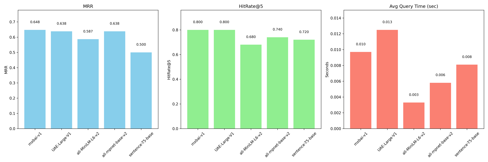

# Virtual Lenny
>  Retrieval-Augmented Generation (RAG) system that recreates **Lenny Rachitsky’s product thinking style** using AWS serverless infrastructure, vector search, and real-time WebSocket streaming.

This project builds a **full end-to-end RAG pipeline**  from scraping real PM content to serving low-latency, streaming answers in a  web UI.

**Target persona**:  [Lenny Rachitsky on LinkedIn](https://www.linkedin.com/in/lennyrachitsky/)


---

## Demo


**Live demo**:  
🌐 https://virutal-lenny-with-eval.vercel.app/

For testing and evaluation, I also included a small script at `src/generate-synthetic-questions.py`. (underhood , the questions are generated locally using Ollama)

This script generates a set of synthetic questions derived from both **LinkedIn posts** and **YouTube transcripts**, and can be used to test the RAG pipeline . 


> NOTE : The first response might take around **7 -12** seconds because I’m using a **mxbai-embed-large-v1** for better retrieval quality (see ablation run time and accuracy across models below). Loading it adds some latency, but the quality boost was worth it for now. Optimizing this tradeoff is an active direction I plan to explore.




## High-Level Architecture

> A detailed, component-by-component breakdown is available in `implementation.md`.  
> This section gives a high-level view of how the system fits together.

### 1. Data Ingestion

Content is ingested from **LinkedIn posts** (via **Apify**) and **YouTube transcripts**, orchestrated end-to-end using **AWS Step Functions** (`/infra/stacks/ingestion_stack.py`). The pipeline follows a structured flow — *Scrape → Clean → Chunk → Embed → Store* — with smart chunking strategies: LinkedIn posts are stored as full, self-contained documents, while YouTube transcripts are split into ~2000-character overlapping segments for better semantic recall. All embeddings are persisted in **Qdrant Cloud**, provisioned via `/infra/stacks/storage_stack.py`.

The deployment success for both the stacks on aws step function : 


---

### 2. RAG Agent

The RAG agent embeds user queries using `mixedbread-ai/mxbai-embed-large-v1` (1024 dimensions) and performs semantic retrieval against **Qdrant Cloud** to fetch the most relevant context. Responses are generated via **AWS Bedrock (Nova Lite)** with token-level streaming and delivered to the client in real time over a **WebSocket API**.

Each response is automatically evaluated using an internal **RAG quality scorer**, which measures retrieval relevance, groundedness , coherence and retrieved context(youtube / linkedin in this case). 

---

### 3. Web Interface

The **frontend** is built using **Next.js 15** and **React 19**, with a simple terminal-style UI using **Tailwind CSS**. I’m still relatively new to frontend work, so this part of the project focuses more on getting the system working end-to-end rather than visual polish, and there may be a few rough edges. The client talks to the backend over a persistent WebSocket connection, streams tokens in real time, and shows the RAG quality score alongside each response. The frontend is deployed on **Vercel**.


The **backend** exposes a **WebSocket API Gateway** (`/infra/stacks/websocket_stack.py`) backed by **AWS Lambda**, responsible for managing connections, routing messages to the RAG agent, and streaming partial responses back to the client. This setup enables real-time interaction and cleanly separates connection lifecycle management (connect / disconnect) from message handling and model inference, which lives under `/agent/*`.


## Setup 

### 1️⃣ Conda Environment (for local testing)

```bash
conda create -n virtual-lenny python=3.11 -y
conda activate virtual-lenny
```


### 2️⃣ Environment Variables

Create .env in the project root:

```bash
# AWS
AWS_REGION=us-east-1
DATA_BUCKET_NAME=virtual-lenny-bucket

# Qdrant
QDRANT_URL=https://<your-cluster>.cloud.qdrant.io
QDRANT_API_KEY=<your-key>

# Apify
APIFY_TOKEN=<your-apify-token>
```


### 3️⃣ Infrastructure Deployment (AWS CDK)

This deploys all three stacks: storage, ingestion, and WebSocket API.
```bash
cd infra

cdk bootstrap
cdk deploy --all 
```
> [WARN] :  The deployment may take a while due to large Docker image builds.

### 4️⃣ Web Client Deployment (Vercel)

```bash
cd client
npm install
echo "NEXT_PUBLIC_WEBSOCKET_URL=<YOUR_WS_URL>" > .env.local
vercel --prod
```
Easiest way on Vercel:
1. Import the GitHub repository
2. Select Next.js and point it to the client/ directory
3. Set NEXT_PUBLIC_WEBSOCKET_URL in environment variables
4. Click Deploy

---

## Common Bugs I Faced (and Fixes)

### 1️⃣ YouTubeTranscriptApi Breaking Change
```text
AttributeError: type object 'YouTubeTranscriptApi' has no attribute 'list_transcripts'
```
It turns out the API behavior changed across versions, so a lot of older examples no longer work.
I followed this discussion / PR and it worked flawlessly for me:https://github.com/langchain-ai/langchain-community/issues/290#issuecomment-3301428239


### 2️⃣ NumPy / Torch / Cython Conflicts (Docker)

Torch and NumPy caused repeated build failures inside Docker, especially when Cython was involved. This was by far the most painful issue during infra setup.

What I did instead:
- Removed Torch entirely from the pipeline
- Stored embeddings as .npz
- Loaded them directly inside Lambda at runtime


If you do want to keep Torch, there’s a lot of discussion around this issue here: https://github.com/mesonbuild/meson/issues/14742


### 3️⃣ Cannot find module @tailwindcss/postcss

This popped up when using Next.js 15 + Tailwind v4.

Fix that worked for me: Upgraded Node.js to v22.13.0

There are also alternative approaches discussed here:https://github.com/tailwindlabs/tailwindcss/discussions/16067

### 4️⃣ Qdrant Request Timeouts

I occasionally ran into random request timeouts during indexing and search. Fix:https://github.com/qdrant/qdrant-client/issues/394#issuecomment-2075283788

---

## Project Structure

```csharp
virtual-lenny/
├── infra/                  # AWS CDK infrastructure
├── lambdas/                # Ingestion + embedding Lambdas
├── agent/                  # WebSocket RAG agent
├── client/                 # Next.js frontend
├── data/                   # Outputs(chunked , raw & embedded)
├── data-ingestion/          # Local testing and scraping testing (not usedin the final deployment)       
├── helpers/                # to get the youtube-id's   
├── src/                    # Local - plotters & synthetic question generation 
├── results/                # Stores the plots & json ablations
├── tests/                  # Tests all the lambdas locally 
├── implementation.md       # Detailed implementation
├── design.md               # Ideal system design
└── README.md
```

---

> **Note**  
> LLMs (mostly Claude Sonnet 4.5) were used extensively while building the `/client` frontend, since frontend development is not my strongest area yet. This may have led to slightly lower code quality or rough edges in that part of the project. The rest of the system (infra, backend, and RAG pipeline) was implemented more directly & hence better developed . 

